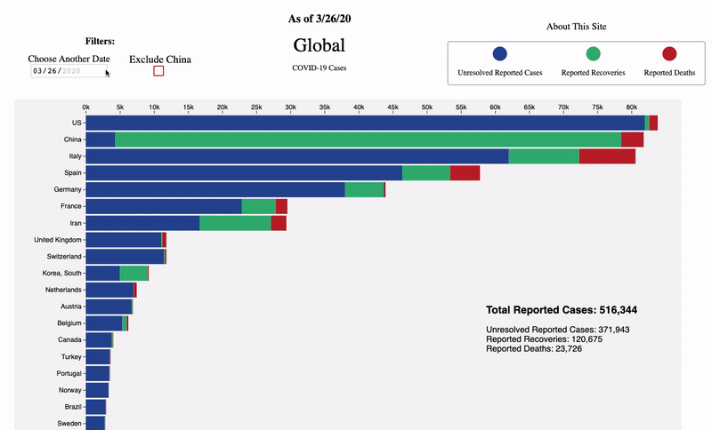
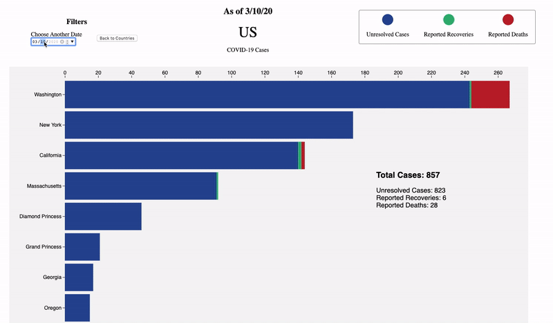

# [CoronaVirusTracker live link](http://covid19trackerapp.com/)

## Background

Coronavirus dominates news cycles around the world, with varying levels of concern from utter hysteria to total indifference.  The goal of this project, *Coronavirus Tracker*, is to provide a data-centric, interactive overview of the coronavirus spread to counter narratives that are not based in fact/numbers.

## Data Source

A challenge given the extremely fluid global situation surrounding coronavirus (not to mention the possibility that some government reporting agencies may not be completely truthful in their statistics reporting), is finding a trustworthy data source that is frequently updated and acceessible (for free) via API.  Luckily, researchers at Johns Hopkins University and elsewhere have quickly created exactly that!   [Data Source example (global confirmed cases)](https://github.com/CSSEGISandData/COVID-19/blob/master/csse_covid_19_data/csse_covid_19_time_series/time_series_covid19_confirmed_global.csv).  
  
  | Province/State               	| Country/Region 	| Lat      	| Long     	| 3/19/20 	| 3/20/20 	| 3/21/20 	| 3/22/20 	| 3/23/20 	| 3/24/20 	| 3/25/20 	|
|------------------------------	|----------------	|----------	|----------	|---------	|---------	|---------	|---------	|---------	|---------	|---------	|
|                              	| Argentina      	| -38.4161 	| -63.6167 	| 97      	| 128     	| 158     	| 266     	| 301     	| 387     	| 387     	|
|                              	| Armenia        	| 40.0691  	| 45.0382  	| 115     	| 136     	| 160     	| 194     	| 235     	| 249     	| 265     	|
| Australian Capital Territory 	| Australia      	| -35.4735 	| 149.0124 	| 4       	| 6       	| 9       	| 19      	| 3       	| 39      	| 39      	|
| New South Wales              	| Australia      	| -33.8688 	| 151.2093 	| 307     	| 353     	| 436     	| 669     	| 669     	| 818     	| 1029    	|
| Northern Territory           	| Australia      	| -12.4634 	| 130.8456 	| 1       	| 3       	| 3       	| 5       	| 5       	| 6       	| 6       	|
| Queensland                   	| Australia      	| -28.0167 	| 153.4    	| 144     	| 184     	| 221     	| 259     	| 319     	| 397     	| 443     	|
  
  
  
 ## Functionality and MVP
   * Filter by:
     * Country - bar graph/calendar of cases and recoveries over time
     * Province/State - bar graph/calendar graph of cases and recoveries over time
     
   * Present Johns Hopkins CSV files data using D3.js (sample for one of several CSV file aggregation below:)
 ```javascript
    d3.csv('https://raw.githubusercontent.com/CSSEGISandData/COVID-19/master/csse_covid_19_data/csse_covid_19_time_series/time_series_covid19_confirmed_global.csv')
        .then(data => { //TOTAL CASES
            data.forEach(row => {                
                // ex values (rowCountryRegion):
                // Thailand  // US  // France
                let rowCountryRegion = row['Country/Region'];
                let provinceState = row["Province/State"];

                if (blacklist.includes(rowCountryRegion)) {
                    // do nothing
                } else {
                    if (dataMaster[rowCountryRegion]) {
                        if (provinceState !== "") {
                            let provinceStateObj = new Object();
                            Object.assign(provinceStateObj, { provinceState: provinceState, provinceStateCases: parseInt(row[date]) });
                            dataMaster[rowCountryRegion]["Province/State"].push(provinceStateObj);
                        }
                        dataMaster[rowCountryRegion]["Province/State"][provinceState]
                        dataMaster[rowCountryRegion].totalCases += parseInt(row[date])
                    } else {
                        let provinceStateObj = new Object();
                        //if row["Province/State"] is "", it means that there is no province/state data for that row (and likely the country is as granular data as we have)
                        if (provinceState !== "") {
                            Object.assign(provinceStateObj, {provinceState: provinceState, provinceStateCases: parseInt(row[date])});
                        }

                        dataMaster[rowCountryRegion] = { 
                            "Province/State": [provinceStateObj], 
                            totalCases: parseInt(row[date]), 
                            totalDeaths: undefined, 
                            totalRecoveries: undefined 
                        };
                    }
                }
            })
        })
```
     
   
 ## Preview
 
   * ### Global Preview
 
 
 
   * ### Country-Specific Preview
     * Note: the Johns Hopkins data was reformatted as of late March to not include US states even though it contained them previously.  I'm hopeful they add this data back in shortly.  As such, the demo as shown below may not be available for the United States currently though it is available for other countries (China, Australia, etc.).


 
 
 ## Architecture and Technologies
   * [D3.js](https://github.com/d3/d3/wiki) 5.15.0 for data wrangling and DOM manipulation for graph creation
   * JavaScript for date selection logic
   * Webpack 4.42.0 to bundle scripts and translate JS as needed
 
 ## Possible Improvements:
  * Calendar view - gives a new visual to understand trends over time, [example](https://observablehq.com/@d3/calendar-view) 
  * Testing data by state in the US using: https://covidtracking.com/api/
  * Sign up your email to get sent when a confirmed case is reported near you
  * Self-diagnosis step by step walkthrough that ends suggesting a specific action, ie "go to the ER", "continue to look for X symptom over the next 7 days", "no need to worry!"
  
  
## Existing Similar Solutions

There are some existing sites that serve a similar function, listed below.  However, none of the websites that I found provide a robust data interactivity capability that might be useful to a user asking questions like: "are there reported cases near my home city/state/country?".  Nor do they provide some kind of alert mechanism for if confirmed cases are reported near their location.  Coronavirus Tracker aims to address these two questions.

Existing/similar Solutions:
  * [Johns Hopkins University Coronavirus dashboard](https://gisanddata.maps.arcgis.com/apps/opsdashboard/index.html#/bda7594740fd40299423467b48e9ecf6)
  * [visalist.io Map](https://visalist.io/emergency/coronavirus)
  * [World Health Organization (WHO) interactive map](https://experience.arcgis.com/experience/685d0ace521648f8a5beeeee1b9125cd)
  * [World o Meter.com](https://www.worldometers.info/coronavirus/)
  
## Final Note:
I'm working with a group of ~20 epidemiologists and technologists to build a smartphone app intervention for COVID-19.  See what we are [up to here](https://www.covid-watch.org/).  If you are interested in getting involved, reach out to me. 
 
 
